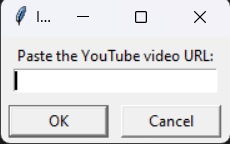

# YouTube Video Downloader

A simple and user-friendly GUI application to download YouTube videos to your local machine.

## Details

This script is built on Python and utilizes the following modules:
- `pytube` for YouTube video downloading
- `tkinter` for the GUI

### Installation

To run this script, you will need to install the necessary Python libraries: pip install pytube tkinter

## Features

- Simple GUI interface
- Paste YouTube URL to download
- Choose your desired download directory
- Auto-generates a unique file name for each download

## Getting Started

1. Clone the repository: git clone https://github.com/Bisalkumar/Youtube_Downloader.git
2. Navigate to the directory: cd YT_Downloader
3. Run the script: python YT_Downloader.py

## How to Use

1. Run the script.
2. A prompt will ask you to paste the YouTube video URL. 
3. After pasting the URL, select your desired download directory.
4. Wait for the download to complete.

## Screenshots

## Contributions

If you'd like to contribute, please fork the repository and make changes as you'd like. Pull requests are warmly welcome.

## License

This project is open-sourced under the MIT license. 

## Acknowledgment

Special thanks to the developers of `pytube` for making YouTube video downloading easy and accessible.